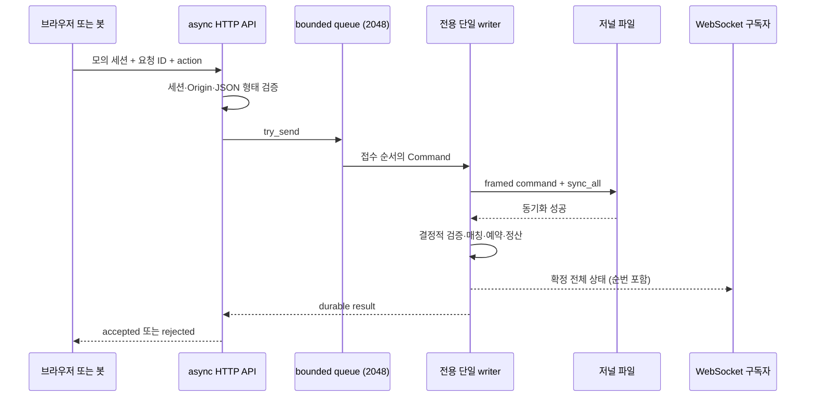

# ADR 001 — 단일 writer와 독립 UI

상태: 구현 및 로컬 검증됨. 결정일: 2026-09-21. 기존 프로젝트의 React/TypeScript/Vite 스택을 재사용하고, 프로젝트 외부 변경 없이 실행할 수 있도록 `trading/frontend`에 별도 앱을 둔다.

## 요청과 공개 시점

이벤트와 HTTP 응답의 네트워크 도착 순서는 보장하지 않는다. 둘 모두 저장 완료와 원자적인 코어 변경 뒤에만 공개하며 클라이언트는 순번과 요청 ID로 연결한다. 도메인 거절도 기록된 확정 결과지만 거래 상태의 부분 변경을 남기지 않는다. 저널 동기화 실패는 성공 ACK 없이 fail-closed로 전환한다. 상세 파일·장애 의미는 [ADR 002](002-durability.md).

코어는 시계·난수·파일·네트워크·mutex에 의존하지 않는다. 서버가 기록한 timestamp를 입력으로 받고, 봇의 난수 결과도 최종 Command로 저널에 남으므로 복구는 기록된 입력 순서를 따른다. seed만으로 다중 프로세스 스케줄링을 재현한다고 주장하지 않는다.

## 대안과 선택 이유

- 공유 호가장을 여러 async worker가 직접 변경하면 부분 체결·예약·취소·요청 중복의 원자성 경계가 복잡해진다. 소규모 합성 시장에는 단일 writer로 상태 순서를 고정하고 async worker는 전송에 집중하는 구성을 선택했다.
- 내구성 파일 I/O를 async runtime worker에서 직접 수행하면 느린 저장장치가 HTTP/WS 처리를 막을 수 있다. 별도 OS writer thread에서 동기화하고 oneshot으로 결과를 돌려준다.
- 무제한 명령 큐는 과부하를 메모리 증가로 숨긴다. crossbeam-channel bounded 2048과 try_send를 사용하고 접수 전 `QUEUE_FULL`을 반환한다. 채널 전체나 서비스 전체의 lock-free/wait-free를 주장하지 않는다. writer의 blocking recv와 파일 동기화는 의도된 동작이다.
- [정확한 의존성 소스 검토](../../evidence/20260921T152249816Z-bounded-queue-source-audit-7c8e0541/review.md)에서 현재 crossbeam-channel 0.5.17 / crossbeam-utils 0.8.23과 positive-capacity array 경로를 확인했다. waiter 없는 ring 전달은 atomic/CAS를 사용하지만 성공한 try_send의 수신자 알림도 std mutex를 획득할 수 있다. 빈 recv와 가득 찬 종료 send는 park할 수 있다. 이 검토는 contention 빈도나 전체 호출의 lock-free 진행 보장을 입증하는 성능 측정이 아니다.
- 매 요청 전체 코어를 clone하여 거래하는 방식 대신 사전 검증 후 한 writer에서 변경한다. 이벤트는 공개 범위로 제한된 snapshot을 Arc로 공유하고 구독자별 송신을 분리한다. 32개 이벤트 큐에서 뒤처진 구독자는 재연결하여 현재 상태를 받는다.
- Vercel 인스턴스 메모리에 상태를 두면 인스턴스 간 일관성과 재시작 내구성을 별도로 해결해야 한다. Vercel에는 정적 UI를, 영속 볼륨을 갖는 별도 Rust 프로세스에는 거래 상태를 배치한다.

## 한계

이 코어에는 문자열·이력·결과 생성 할당이 있으며 실제 할당 측정치는 [성능 문서](../performance.md)에 공개한다. 초기 Vec와 재사용 fill scratch는 사전 할당하지만 zero-allocation 목표를 아직 충족하지 못했다. 전체 주문·체결·중복 요청 이력을 보존하여 메모리가 데이터셋 크기에 따라 증가한다. 단일 writer의 처리량과 checkpoint 동안의 대기는 실측과 장시간 관찰 대상으로 남긴다.

`demo-*` 세션은 합성 계정 식별 수단이다. 실제 사용자 인증·인사 연동을 구현한 것으로 해석하지 않는다. 루트 앱은 수정하지 않았으며 독립 UI와 연동 절차만 납품한다. 컨테이너/HTTPS/실제 Vercel 배포 검증 범위는 배포 문서에서 구분한다.
