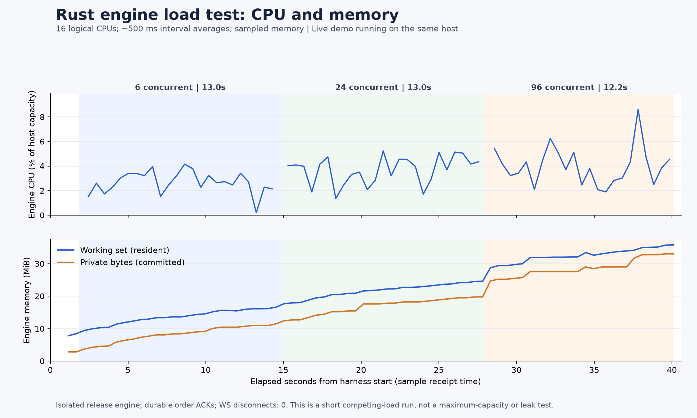

# 직렬화 변경 후 엔진 부하 재검증

2026-09-21 실행 전 계획과 실제 결과. 이전 부하의 WS 연결 단절과 그 이후 구현 변경 때문에 후속 검증을 한 번 수행했다. 사전 계획은 21:09 KST에 작성했고, 아래 결과는 완료한 실행의 원본으로 추가했다.

## 실행 전 고정 조건

- 대상은 회귀 검증을 마친 release SHA256 `f518b95fb3eaccdabd40d0ee828e830a2ec6b8d959610fc629043e46856ef240`. 고유 증거 폴더로 복사해 전용 합성 데이터와 임시 loopback 포트에서 실행한다.
- [첫 부하](engine-load-test.md)와 같은 입력: warm-up24명령, 12개 bot 계정을 두 그룹으로 교대, 매도 maker 전부 durable ACK 뒤 매수 taker batch, 가격1000·수량1. 동시성6/24/96 각각20초 또는6000명령, 전체18000명령/20000HTTP, work75초/cleanup88초/전체90초 한도와512MiB 관측 RSS cap을 유지한다.
- node:http keep-alive, 같은 Node 루프의 WS 소비자1개,500ms Windows CPU/메모리 sampler를 사용한다. queue·저널sync·snapshot범위·이벤트계약을 변경하지 않는다. 정상데모14프로세스와관찰기를중단하지않는경쟁부하이며조용한B/C결과가아니다.
- 실험 준비 변경은 예상 binary SHA를 명령에 명시하는 사전 검사, 소스 해시 기록, 의도적인 cleanup **직전** WS 상태 보존뿐이다. 기존 workload/timeout/CPU 집계/메모리 한도를 바꾸지 않는다. `complete`는 기존대로 ACK·정합성·cleanup 성공이고, `continuous_through_final_state`는 별도 판정이다.
- 신규 빌드·테스트·그림 생성·대량 분석은 측정 구간에 실행하지 않는다. 사용자의 다른 작업과 일반 시연은 계속될 수 있으며, 실행 전 주요 프로세스와 실제 조건을 보존한다.

## 판정과 해석

각 ACK·체결의 계정/요청/주문/체결 ID와 maker 가격, 각 phase barrier의15계정 전체 자산·예약·누적건수·순번·빈book을 검증한다. 정상 WS의 초기 상태부터 최종 순번까지 누락/오류/예상외단절0이고 cleanup직전에열려있는지 별도로 판정한다. 실패하면 원본과 서버종료사유를 남기고 자동 재접속·제한 완화·재실행으로 결과를 바꾸지 않는다.

CPU는16논리CPU전체용량기준 구간평균이고RSS는관측최댓값이다. 이전실행의96단계는WS가없었으므로후속96단계와속도·CPU를동일조건으로비교하지않는다. 첫실행09bc→현재f518 사이에는직렬화외에종료진단/peer Close 응답변경도있다. 호스트경쟁과시연누적이력도달라한번의후속실행만으로개선원인·최대용량·서비스SLA를입증하지않는다.

현재 일반 데모는 이전09bc 바이너리 PID20540과observer18184를유지한다. 전후manifest와PID/시작시각을비교하고,장기관찰과부하격리프로세스정리를분리해기록한다.

## 21:10–21:11 KST 실제 결과

**주문 정합성과 최종 순번까지의 WS 연속성 모두 통과했다.** [실제 wrapper](../evidence/20260921T121024429Z-engine-load-after-ws-encoding-f0cf0d28/run.json)는 exit0, [원본 summary](../evidence/2026-09-21T12-10-24-565Z-engine-load-18040a36/summary.json)의 elapsed는40.304초다. 초기 상태 포함17,737개frame이순번0…17,736을수신했고누락·오류·예상외단절0이었다. 의도적인 cleanup 직전소켓OPEN/최종순번도달/`continuous_through_final_state:true`를별도로기록했다.

| 동시성 | 명령 / 체결 | 시간 | 명령/초 | ACK p50 / p95 / p99 / 최대(ms) |
|---|---:|---:|---:|---|
| 6 | 6,000 / 3,000 | 13.048초 | 459.85 | 7.431 / 12.677 / 17.170 / 585.848 |
| 24 | 5,952 / 2,976 | 13.044초 | 456.29 | 27.351 / 49.664 / 92.881 / 267.193 |
| 96 | 5,760 / 2,880 | 12.171초 | 473.25 | 102.501 / 194.764 / 288.422 / 372.736 |

warm-up포함17,736명령·8,868체결 모두 accepted/durable/중복false,명령HTTP오류·거절0. 모든phase가완전cycle을유지하는명령cap에도달해20초전에끝났다. 총HTTP시도17,744개이며15계정자산·예약·누적건수·순번·빈book검증을통과했다. 부분체결·취소·큐포화는이번입력에없다.

| 동시성 | 엔진 CPU 평균 / 최대 구간 | client CPU 평균 / 최대 구간 | 엔진 최대 working set / private(MB) | client 최대 working set / private(MB) |
|---|---|---|---|---|
| 6 | 2.684% / 4.159% | 5.194% / 6.998% | 17.39 / 12.01 | 233.61 / 274.83 |
| 24 | 3.683% / 5.232% | 5.831% / 8.348% | 25.76 / 20.70 | 361.47 / 349.00 |
| 96 | 3.986% / 8.595% | 6.231% / 7.958% | 37.51 / 34.61 | 385.01 / 366.35 |

MB=1,000,000bytes,CPU=16논리CPU전체용량대비다. 유효CPU구간24/25/23개,제외0,실제커버시간12.334/12.779/11.785초다. 엔진관측최대working set37.51MB(35.77MiB),client385.01MB로각512MiB관측cap안이었다. 전체호스트CPU·순간peak·최대용량·누수시험을뜻하지않는다.

[그림 검산](../evidence/20260921T121156927298Z-engine-load-plot-b06e6b8e/plot-verification.json)에서72개CPU구간을원시카운터로별도재계산했고이미지를직접열어축·단위·phase표시를확인했다. [rawCPU/메모리](../evidence/2026-09-21T12-10-24-565Z-engine-load-18040a36/resource-samples.json), [rawACK](../evidence/2026-09-21T12-10-24-565Z-engine-load-18040a36/requests.json), [rawWS](../evidence/2026-09-21T12-10-24-565Z-engine-load-18040a36/ws-events.json)를보존한다.

## 정리와 남은 한계

격리엔진22180은shutdown뒤exit0,client10908·sampler12628도종료했다. [사후실제프로세스확인](../evidence/2026-09-21T12-10-24-565Z-engine-load-18040a36/post-verification.json)은일반데모14개+observer/helper의16개PID와시작시각·manifest가사전과같음을확인했다. 서버종료로그는최종순번17736에서`peer_closed/receive/close_reply:flushed`1개였고부하중lag나send timeout은기록되지않았다.

[/root/durability의 독립 검산](../evidence/2026-09-21T12-12-35-245Z-engine-load-independent-review-827afcd4/README.md)은rawACK원장·FIFO·4개state·CPU·메모리·모든WS순번을재구성해불일치가없음을확인했다. 부하전첫`/health`는엔진listen이완료되기전`ECONNREFUSED`1회였고readiness재시도로성공했다. 최초오프라인검토가모든HTTP200을가정해실패한자료도보존하고setup/거래를구분해재검산했다. 명령오류0과startup모든시도성공은다른주장이다.

phase별WS frame5951/5761은24단계마지막순번11976의callback이96단계에태깅되어생긴차이이며전체누락이아니다. 최종frame callback40130.245ms→종료직전OPEN기록40142.734ms→의도close40162.217ms순서가raw에서일치한다. 그close1005는코드를지정하지않은클라이언트종료뒤의값이며첫실행의예상외1005와구분한다.

이번실행의6·24단계엔진CPU평균은이전실행에서관측한5.835/7.355%보다낮았지만처리량·ACK tail지연의전반적향상은입증하지못했다. 새24단계p99는92.881ms로이전56.583ms보다높았다. 이전96단계는WS가없었고이번에는있으므로직접비교하지않는다. 직렬화자체할당감소는별도의[같은입력AB/BA/AB계측](ws-serialization.md)이근거이며이번서비스부하의인과관계증명과구분한다.

반복실행이나자동재접속은하지않았다. 다음서비스성능검증은6시간관찰종료후새binary의조용한B/C구간으로분리한다.
