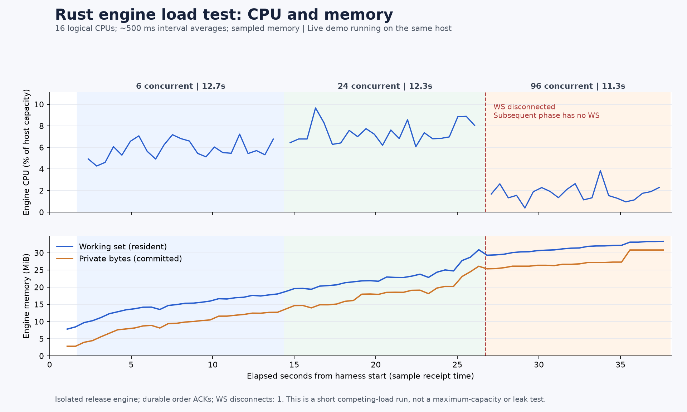

# 엔진 부하 테스트 — CPU·메모리 동시 관측

담당 `/root/matching_core`. 사용자 요청에 따른 실제 부하 테스트이며, **정상 데모와 6시간 관찰기를 계속 실행한 상태의 자원 경쟁 스트레스**다. 기존 quiet A/B/C benchmark를 대체하지 않는다. 정상 엔진 PID 20540, observer PID 18184, 데모 포트 8787/5175는 제어하지 않는다.

## 실행 전 고정 범위

`node scripts/engine-load.mjs --competing-resource-stress`는 release SHA `09bcf75b80a2a85c6a52168d2404f23a230e73b958fc6814daa300650fc5ac56`를 고유 evidence 폴더에 복사하고 새 데이터셋·임시 loopback 포트에서만 실행한다. 소스 엔진은 변경하지 않는다. 실행 전후 정상 manifest SHA·14개 PID·observer 생존을 대조한다.

- warm-up: 동시 6개의 maker와 6개 taker를 두 round 실행, 총 24명령.
- 측정: 동시성 6·24·96, 각각 약 20초 또는 phase당 최대 6,000명령. 전체 18,000명령·HTTP Upgrade 포함 20,000 HTTP 이내.
- 각 round는 12개 bot을 6개씩 두 그룹으로 나눈다. 첫 그룹의 매도 maker(price 1,000, quantity 1)를 균등 분배하고 전부 durable ACK된 뒤 다른 그룹의 같은 수량 매수 taker를 제출한다. 다음 round는 그룹을 바꾼다. 두 round가 끝난 cycle에서만 phase를 마쳐 모든 계정 자산을 원복한다. batch는 동일 계정도 여러 요청을 동시에 가질 수 있다.
- 각 ACK의 accepted/durable/unique order ID, 체결당 maker ID·buyer/seller·maker price 1,000·수량 1·trade ID를 검사한다. 모든 maker가 정확히 한 번 체결되어야 한다.
- phase 뒤 전체 15계정 잔고·예약·누적 주문/체결 건수, command/event sequence·volume·빈 book을 대조한다. 공개 응답의 200 terminal orders/1,000 trades는 전체 이력이라고 주장하지 않는다.
- 전체 work deadline 75초, 소유 프로세스 cleanup 88초 이내, 파일 저장까지 전체 90초 이내를 목표로 제한한다. 명령·시간·메모리 한도 또는 정합성 실패 시 중단하며 실패 원본을 남긴다. CPU는 사용량을 관측하며 별도 사용률 상한은 없다. 결과를 성공으로 만들기 위해 반복하지 않는다.
- 엔진 working set 및 client RSS 관측 cap은 각각 512MiB. Windows sampler 약 500ms, client 자체 RSS guard 250ms이며 관측 사이 순간 최고값을 보장하지 않는다.

## 계측 의미

동일 Node client에서 `node:http` keep-alive를 사용한다. 요청 RTT는 submit→응답 JSON 파싱 완료로 큐 대기·journal `sync_all`·HTTP·직렬화·client 처리를 포함한다. phase throughput은 maker/taker 완료 barrier를 포함한다. 부분 체결·취소·큐 포화는 이번 입력에 포함하지 않는다.

별도 Windows sampler가 엔진과 부하 client의 **`TotalProcessorTime.TotalSeconds` 누적 CPU 시간**, working set, private bytes, 실제 시각 및 Stopwatch elapsed를 기록한다. CPU 사용률은 연속 샘플의 delta CPU seconds / delta elapsed seconds / **실제 16 logical CPUs** ×100이다. 시간 가중 평균과 최대 구간 평균을 구분하고 missing/reset/불가능한 delta/2초 초과 샘플 gap은 제외한다. 누적 CPU를 백분율로 오인하거나 결측값을 0으로 채우지 않는다. CPU는 500ms 구간 평균으로 순간 peak가 아니다. sampler overhead는 부하 조건에 있으나 엔진/client 사용률에는 합산하지 않는다.

일반 WS 소비자 1개가 접속하여 callback sequence와 수신 byte를 기록한다. 각 phase의 실제 연결 상태, 누락·예기치 않은 disconnect·최종 sequence 도달 여부를 별도로 보고한다. 브라우저 rendering 지연은 측정하지 않는다. raw HTTP 결과, resource samples, WS 수신 이력, phase 상태, 종료 코드와 보존 데이터셋을 남긴다.

## 실행 결과

2026-09-21 **20:01:25~20:02:04 KST에 1회 실행**했다. 구문 검사와 `--help`를 먼저 통과했고, 그래프 준비 작업 종료 신호를 받은 뒤 시작했다. 정합성/cleanup의 `complete=true`, wrapper exit 0이다. **WebSocket 연속성은 실패했다.** `complete`는 bounded workload의 ACK·상태·정리 성공이며 모든 부가 관측의 통과나 3×20초 완료라는 의미가 아니다.

- [원본 summary](../evidence/2026-09-21T11-01-25-875Z-engine-load-8774ce30/summary.json): `planned_phase_coverage`와 `resources_available`을 별도 제공한다.
- [실제 명령·시작/종료·exit](../evidence/core-20260921T200125744-engine-load-console/run.json), [raw CPU/메모리](../evidence/2026-09-21T11-01-25-875Z-engine-load-8774ce30/resource-samples.json), [raw HTTP 결과](../evidence/2026-09-21T11-01-25-875Z-engine-load-8774ce30/requests.json), [WS 이력](../evidence/2026-09-21T11-01-25-875Z-engine-load-8774ce30/ws-events.json).
- [CPU·메모리 그래프](../evidence/20260921T110252023359Z-engine-load-plot-bbb045e3/engine-cpu-memory.png), [root의 67개 CPU 구간 독립 재계산](../evidence/20260921T110252023359Z-engine-load-plot-bbb045e3/plot-verification.json). 그래프는 WS 단절과 96단계의 무WS 조건을 표시한다.
- [/root/durability 독립 검토](../evidence/2026-09-21T11-08-10-329Z-engine-load-independent-review-1389375f/README.md): 원시 ACK로 계정별 잔고·체결을 재구성하고 CPU·메모리를 재계산했으며 불일치는 없었다. WS 수신 실패와 단계별 조건 차이는 결과 해석의 제한으로 유지한다.

## 실제 처리·지연

| 동시 요청 수 | 측정 시간 | 명령 / 체결 | 명령/초 | ACK p50 / p95 / p99 / 최대 (ms) | 종료 이유 |
| --- | ---: | ---: | ---: | --- | --- |
| 6 | 12.700초 | 6,000 / 3,000 | 472.44 | 7.879 / 12.930 / 17.037 / 56.331 | phase 6,000명령 cap |
| 24 | 12.333초 | 5,952 / 2,976 | 482.60 | 27.073 / 48.211 / 56.583 / 106.873 | 다음 완전 cycle이 phase cap 초과 |
| 96 | 11.291초 | 5,760 / 2,880 | 510.14 | 95.256 / 175.430 / 186.660 / 226.318 | 다음 완전 cycle이 전체/phase cap 초과 |

세 동시성 모두 실행했지만 **모두 명령 cap에 먼저 도달하여 20초를 채우지 않았다**. warm-up 포함 17,736명령·8,868체결, HTTP Upgrade 포함 17,744 HTTP 시도였다. 전체 elapsed 집계는 38.196초, wrapper wall time은 약 38.504초다. 명령 ACK는 모두 `accepted`, `durable:true`, `duplicate:false`였으며 HTTP 명령 오류·거절은 0이었다. 이 RTT는 신규 엔진의 누적 이력이 증가하는 동일 실행에서 측정했으며 세 phase가 독립 데이터셋 비교는 아니다.

모든 phase barrier에서 15계정의 포인트 1,000,000·휴가 1,000시간, 예약 0으로 원복됐고 누적 계정별 orders_count/trades_count·command/event 순번·volume이 raw ACK/체결과 일치했다. 최종 book은 비어 있었다. 임직원 3계정은 거래에 참여하지 않았다. 부분 체결·취소·queue saturation을 이번 결과에 포함해 주장하지 않는다.

## CPU·메모리

CPU는 **16 logical CPUs 전체 용량 대비 백분율**이다. 프로세스 누적 CPU seconds를 사용률로 직접 표시한 값이 아니다. 전체 raw resource sample 73개 중 phase별 24/24/22개, 유효 CPU delta 구간 23/23/21개이며 해당 구간에서 결측·reset·gap 제외는 0개였다. CPU가 실제로 커버한 시간은 11.865/11.816/10.815초로, phase 양 끝에서 sampler가 포함하지 못한 시간까지 측정했다고 주장하지 않는다.

| 동시성 | 엔진 CPU 평균 / 최대 구간 평균 | 클라이언트 CPU 평균 / 최대 구간 평균 | 엔진 관측 최대 WS / private (MB) | 클라이언트 관측 최대 WS / private (MB) |
| --- | --- | --- | --- | --- |
| 6 | 5.835% / 7.228% | 4.700% / 6.058% | 18.89 / 13.30 | 204.77 / 262.06 |
| 24 | 7.355% / 9.658% | 5.802% / 8.122% | 32.38 / 27.34 | 341.16 / 344.79 |
| 96 | 1.752% / 3.843% | 1.029% / 2.062% | 34.93 / 32.29 | 232.20 / 218.59 |

MB는 1,000,000 bytes다. 각 프로세스의 512MiB(536,870,912 bytes) 관측 cap 안이었다. 엔진은 주문·체결·dedup 이력을 보존하고 클라이언트는 raw ACK 및 WS sequence를 수집하므로 이 증가만으로 누수 여부를 단정하지 않는다. 전체 호스트 CPU·브라우저·sampler/helper의 메모리를 엔진값에 포함하지 않았다.

## WebSocket 제한과 정리

초기 snapshot 포함 WS frame 11,936개를 받았고 수신한 sequence 내부 gap은 0이었다. 그러나 20:01:52.591 KST, 시작 후 26.716초에 **예기치 않은 close code 1005가 1회 발생**했다. 마지막 event sequence는 11,935였고 최종 17,736까지 따라잡지 못했다. 24단계는 마지막 부분에서 연결이 끊겼으며, **96단계는 시작부터 WS 소비자가 없는 조건**이었다. 재접속하거나 반복 실행하지 않았다. 따라서 96단계의 낮아진 CPU·높아진 처리량을 동일 조건의 확장성 개선으로 해석할 수 없다. 서버의 세부 종료 원인은 기록되지 않아 특정 lag 경로가 원인이라고 확정하지 않는다.

격리 엔진 PID 22032/포트 62445는 관리자 shutdown 후 실제 exit 0, sampler PID 3032와 부하 client PID 10036도 종료를 확인했다. 정상 데모 manifest SHA·14개 PID·observer PID 18184는 전후 동일하고 생존했다. [후속 확인과 실행 스크립트 hash](../evidence/2026-09-21T11-01-25-875Z-engine-load-8774ce30/post-verification.json)를 보존했다. 정상 데모의 전체 관찰 결과는 root의 별도 장기 기록이며 이 짧은 부하 결과만으로 정상 데모 무영향을 단정하지 않는다.

첫 실행 당시 스크립트는 **정상 engine PID 20540, observer PID 18184 및 release binary SHA에 명시적으로 고정**되어 있었다. 이후 검증된 직렬화 변경을 확인하기 위해 예상 SHA를 `--expected-binary-sha256 <64hex>`로 명시하도록 개선했고, 현재도 두 보호 PID와 16논리CPU 조건은 유지한다. 현재 명령은 `node scripts/engine-load.mjs --competing-resource-stress --expected-binary-sha256 <검증한 release SHA>`다. 데모 재시작 뒤에는 당시 manifest/PID·바이너리를 다시 검토해야 한다. 위 첫 실행 원본은 유지하며, 새 바이너리의 1회 후속 부하와 별도의 WS 연속성 판정은 [후속 검증](engine-load-after-serialization.md)에 기록했다.
